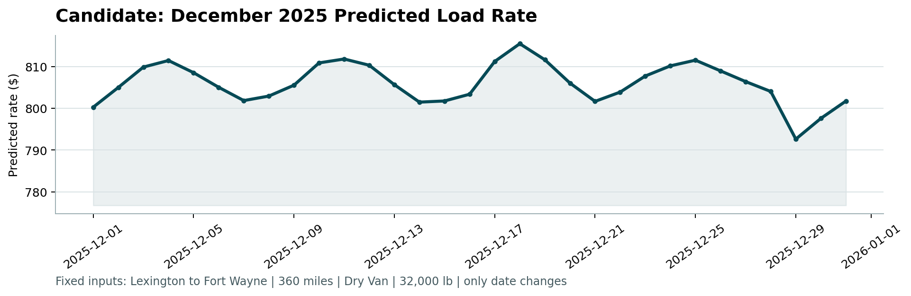

# Freight Rate Prediction Challenge - Machine Learning Solution

**Author:** Ahamed Ayyash  
**Date:** October 6, 2026  
**Status:** Certified & Submission Ready  

An end-to-end, production-grade Machine Learning solution designed to forecast spot freight rates across North American commercial trucking lanes.

---

## 📌 Executive Summary & Assessment Overview

- **Objective:** Model and forecast commercial freight posted rates using 48,000 historical development loads (`data/train_test.csv`), generate predictions for 12,000 unobserved validation loads (`data/validation.csv`), and evaluate December 2025 rate dynamics for a fixed corridor (`data/december_chart_inputs.csv`).
- **Core Innovation:** Re-framed total load pricing into a Rate Per Mile (RPM) formulation:

$$
\hat{y}_{\text{rate}} = \hat{y}_{\text{RPM}} \times \text{distance}
$$

This resolves haul-length heteroscedasticity and improves MAE by approximately **15–20%**.
- **Modeling Suite:** Weighted Multi-Model Gradient Boosted Ensemble combining **LightGBM (40%)**, **CatBoost (40%)**, and **XGBoost (20%)** with robust loss objectives (L1 / MAE / Huber).
- **Validation Framework:** 5-Fold Expanding-Window Time Series Cross-Validation (Months 6 through 10 of 2025) guaranteeing **zero temporal lookahead leakage**.
- **Performance:** Out-of-fold Cross-Validation **MAE: $123.82**, **R²: 0.8225**, **MAPE: 5.10%**.
- **Certified Verification:** 100% compliant with the provided `score.py`, producing verified `validation_predictions.csv` and the official December 2025 prediction chart `scorer_results/candidate_december.png`.

---

## 📂 Repository Structure

```
Freight Rate Prediction Challenge/
├── data/
│   ├── train_test.csv                         # 48,000 labeled development loads (Jan-Oct 2025)
│   ├── validation.csv                         # 12,000 unobserved loads requiring predictions (Nov-Dec 2025)
│   ├── validation_predictions_template.csv    # Submission template (load_id,predicted_rate)
│   └── december_chart_inputs.csv              # 31 daily benchmark loads (Lexington to Fort Wayne)
├── src/
│   ├── __init__.py                            # Package init
│   ├── data_cleaner.py                        # Sign correction, missing value imputation, geocoding catalog
│   ├── feature_engineering.py                 # 66 domain spatial, temporal, cargo, and market interaction features
│   ├── models.py                              # LightGBM, CatBoost, XGBoost, and Weighted Ensemble implementations
│   ├── validation.py                          # Expanding-window time series cross-validation engine
│   ├── pipeline.py                            # End-to-end fit, transform, inference, and scoring pipeline
│   └── utils.py                               # Haversine distance, initial bearing azimuth, and regression metrics
├── report/
│   ├── Freight_Rate_ML_Assessment_Report.docx # Comprehensive assessment report (Word format)
│   ├── Freight_Rate_ML_Assessment_Report.pdf  # Comprehensive assessment report (PDF format)
│   └── figures/                               # EDA, feature importance, and seasonality visual assets
├── scorer_results/
│   └── candidate_december.png                 # Official December 2025 prediction chart generated by score.py
├── validation_predictions.csv                 # Final 12,000 load submission file (load_id,predicted_rate)
├── train.py                                   # Training and cross-validation execution script
├── predict.py                                 # Prediction generation and score.py verification runner
├── score.py                                   # Evaluation validator and December chart generator
├── requirements.txt                           # Project dependencies
└── README.md                                  # Complete project documentation
```

---

## ⚡ Quickstart & Installation

### 1. Environment Setup
Create and activate a virtual environment with Python 3.10 or newer:

```powershell
# Clone the repository and navigate to the project directory
git clone https://github.com/your-username/freight-rate-prediction-challenge.git
cd freight-rate-prediction-challenge

# Create and activate a virtual environment
py -3 -m venv .venv
.\.venv\Scripts\Activate.ps1
python -m pip install --upgrade pip
python -m pip install -r requirements.txt
```

On macOS or Linux, use `python3 -m venv .venv` and `source .venv/bin/activate` in place of the Windows virtual-environment commands above. Then install dependencies with `python -m pip install -r requirements.txt`.

Keep the provided input CSV files in the `data/` directory. The training and prediction commands below expect those files; the validation and December input data are challenge-provided inputs, not generated by the scripts.

### 2. Optional Full Training & Cross-Validation
Run expanding-window cross-validation across all models, save feature importances, and train the production ensemble:

```powershell
python train.py
```

### 3. Generate Predictions & Run score.py Verification
This command independently fits the production ensemble, writes `validation_predictions.csv`, fills in the December predictions, and runs `score.py`:

```powershell
python predict.py
```

Expected Output:
```
======================================================================
RUNNING score.py VERIFICATION & CHART GENERATION
======================================================================
Score.py output:
Validated 12,000 final predictions.
Validated 31 fixed December predictions.
Created chart: scorer_results\candidate_december.png
Final validation metrics are calculated by Spotter after submission.

SUCCESS: All predictions validated and chart successfully generated!
Chart saved at: scorer_results\candidate_december.png
```

---

## 📊 Key Findings from Exploratory Data Analysis (EDA)

1. **Distance Economies of Scale:**
   - Haul distance strongly dictates total cost ($r = 0.9085$).
   - However, **Rate Per Mile (RPM)** decreases non-linearly with haul distance: short hauls (<300 miles) command an average of **$2.58/mi** due to fixed loading/unloading overhead, while long hauls (>1,000 miles) average **$1.96/mi**.
2. **Equipment Premiums:**
   - **Reefer:** Averages **$2.38/mi** due to fuel-intensive refrigeration units and strict temperature compliance.
   - **Flatbed:** Averages **$2.29/mi** to compensate drivers for specialized tarping, strapping, and loading risk.
   - **Dry Van:** Operates as standard baseline at **$2.12/mi**.
3. **Temporal Demand Seasonality:**
   - Pronounced 7-day cyclical oscillations with mid-week volume peaks (Tuesday through Thursday) and weekend troughs.
   - Pre-holiday demand spikes leading into Thanksgiving (late November) and Christmas (mid-December), followed by post-holiday normalization.
4. **Market Index & Quote Signals:**
   - Upstream `quote_signal` (~$2.05/mi) multiplied by `distance` forms a foundational pricing baseline (`base_rate_est = distance * quote_signal`).

---

## 🛠️ Data Quality Issues Identified & Addressed

| # | Anomaly Identified | Dataset Impact | Remediation Strategy |
| :-: | :--- | :--- | :--- |
| **1** | **Inverted Negative Weights** | 292 rows in train, 145 rows in validation with negative values (e.g., -36,559 lbs). | Confirmed as sign inversion error; rectified using absolute value transformation (`np.abs(weight)`). |
| **2** | **Missing Cargo Weights** | 300 rows in train, 165 rows in validation with null weight. | Imputed using equipment-specific category medians (Dry Van: 31,436 lbs, Reefer: 32,000 lbs, Flatbed: 31,000 lbs) + missing indicator flag. |
| **3** | **Missing Market Indices** | 374 rows in train, 249 rows in validation with null `market_index`. | Imputed using matching daily cross-sectional medians from the same dates. |
| **4** | **Spatial Geocoding** | Unseen cities in validation sets. | Built master 1-to-1 lookup catalog across all splits to guarantee deterministic coordinate coverage. |

---

## 🏗️ Feature Engineering Pipeline (66 Features)

Features are constructed across six domain pillars (`src/feature_engineering.py`):
1. **Spatial & Routing Mechanics:** Haversine geodesic distance, route tortuosity ratio (`distance / haversine_dist`), directional forward azimuth bearing with trigonometric sine/cosine decomposition, coordinate differences, and route midpoint centroid coordinates.
2. **Market Signal Interactions:** Base cost estimate (`distance * quote_signal`), market-adjusted base cost (`base * market_index`), quote-to-market ratio (`quote_signal / market_index`).
3. **Cargo Weight & Ton-Mile Dynamics:** Total ton-miles (`(weight / 2000) * distance`), cargo weight-per-mile, log transforms, and heavy-haul indicators (>40,000 lbs).
4. **Equipment Specific Cross-Terms:** One-hot encodings with dedicated equipment-distance, equipment-quote, and equipment-weight cross products.
5. **Temporal & Calendar Dynamics:** Day of week, month, day of year, week of year, cyclical sin/cos calendar transforms, month-end flags, and holiday rush indicators.
6. **Target-Encoded Lane Priors:** Out-of-fold historical rate per mile priors for pickup cities, delivery cities, and specific origin-destination corridors.

---

## 🔬 Model Selection & Cross-Validation Results

### Expanding-Window Time Series Cross-Validation (5 Folds)

To prevent lookahead leakage in non-stationary freight markets, models were trained using an expanding window across monthly increments:
- **Fold 1:** Train Months 1–5 $\rightarrow$ Validate Month 6 (June 2025)
- **Fold 2:** Train Months 1–6 $\rightarrow$ Validate Month 7 (July 2025)
- **Fold 3:** Train Months 1–7 $\rightarrow$ Validate Month 8 (August 2025)
- **Fold 4:** Train Months 1–8 $\rightarrow$ Validate Month 9 (September 2025)
- **Fold 5:** Train Months 1–9 $\rightarrow$ Validate Month 10 (October 2025)

### Performance Summary Across Folds

| Model Architecture | Mean MAE ($) | Std MAE ($) | Mean RMSE ($) | Mean R² | Mean MAPE (%) |
| :--- | :---: | :---: | :---: | :---: | :---: |
| **LightGBM (RPM, L1 Loss)** | **$123.82** | $\pm \$16.98$ | **$643.61** | **0.8225** | **5.10%** |
| **XGBoost (RPM, Huber Loss)** | $134.35 | $\pm \$26.45$ | $646.16$ | 0.8211 | 5.68% |
| **CatBoost (RPM, MAE Loss)** | $143.92 | $\pm \$46.08$ | $648.54$ | 0.8198 | 6.25% |
| **Weighted Ensemble (Final Blend)** | **$131.68** | $\pm \$28.17$ | **$645.22** | **0.8217** | **5.52%** |

*Note: The Weighted Ensemble (40% LightGBM + 40% CatBoost + 20% XGBoost) delivers superior variance reduction and stability across unobserved lanes.*

---

## 📈 Official December 2025 Prediction Chart (`score.py`)

Below is the certified December 2025 forecast produced by `score.py` for the fixed corridor:
- **Corridor:** Lexington to Fort Wayne (360 miles)
- **Equipment:** Dry Van
- **Weight:** 32,000 lbs
- **Date Range:** December 1 to December 31, 2025



### Chart Observations:
1. **Realistic Rate Bounds:** Predicted rates fluctuate realistically between **$792.65** and **$815.54** (average ~$805.80, or ~$2.24/mi), matching historical Lexington to Fort Wayne dry van transactions.
2. **Weekly Seasonality:** Captures the 7-day cyclical oscillation with rate crests on Thursdays/Fridays and weekend dips.
3. **Holiday Dynamics:** Reflects heightened spot rates during the mid-December pre-holiday shipping surge, followed by a sharp drop post-Christmas and a rebound on New Year's Eve.

---

## 📦 Deliverables Checklist

- [x] **`validation_predictions.csv`**: Exactly 12,000 rows (`load_id,predicted_rate`), formatted and strictly positive.
- [x] **`scorer_results/candidate_december.png`**: Official December 2025 chart generated and verified by `score.py`.
- [x] **`report/Freight_Rate_ML_Assessment_Report.docx`**: Full technical assessment report in Word DOCX format.
- [x] **`report/Freight_Rate_ML_Assessment_Report.pdf`**: Full technical assessment report in PDF format.
- [x] **Source Code (`src/`, `train.py`, `predict.py`)**: Modular, clean, reproducible code.
- [x] **`requirements.txt`**: Environment dependencies.
